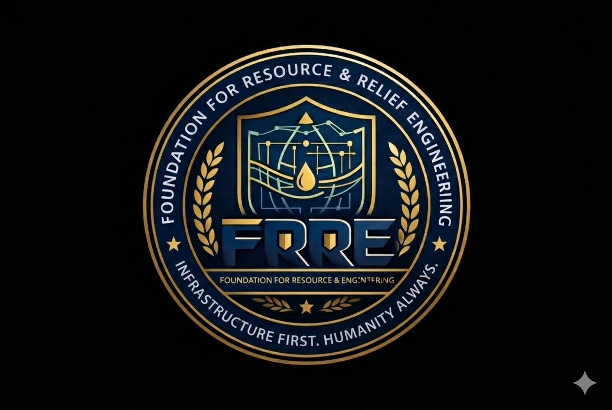

# FRRE-Foundation-for-Resources-Relief-Engineering
FRRE – Foundation for Resource &amp; Relief Engineering is built on one belief: মানুষ মানুষের জন্য. We engineer sustainable water and resource systems with compassion and accountability. Our vision is dignified infrastructure for every community. Our mission: Infrastructure First. Humanity Always.
<!DOCTYPE html>
<html lang="en">
<head>
<meta charset="UTF-8">
<meta name="viewport" content="width=device-width, initial-scale=1.0">
<title>FRRE – Foundation for Resource & Relief Engineering</title>

</head>

<body>

<header>

<h1>FRRE</h1>

Infrastructure First. Humanity Always.

<nav>
<a href="#about">About</a>
<a href="#services">Services</a>
<a href="#model">Model</a>
<a href="#pricing">Pricing</a>
<a href="#partners">Partners</a>
<a href="#contact">Contact</a>
</nav>
</header>

<section class="hero">
<h2>Engineering Public Resource Infrastructure</h2>

Authority-Driven • Measurable • Scalable

</section>

<section id="about">
<h3>About FRRE</h3>

Foundation for Resource & Relief Engineering (FRRE) is a public resource engineering authority focused on scalable infrastructure systems including water distribution, civic deployment frameworks, and measurable CSR-backed systems.

</section>

<section id="services">
<h3>Core Services</h3>

<h4>Water Infrastructure Deployment</h4>

QR-verified engineered public water access systems.

<h4>Engineering Design & Blueprinting</h4>

Technical modeling and compliance mapping.

<h4>Infrastructure Audit</h4>

Authority-grade compliance and certification.

<h4>CSR Impact Certification</h4>

Structured reporting and impact validation.

</section>

<section id="model">
<h3>Free Water + Sustainable Distribution Model</h3>

<h4>Free Water Infrastructure Units</h4>

Sponsor-funded civic hydration systems.

<h4>Paper Bag Model</h4>

Sustainable branded distribution replacing plastic waste.

<h4>Jute Bag Civic Identity Model</h4>

Premium reusable civic engagement carriers.

</section>

<section id="pricing">
<h3>Service Pricing (Base Authority Tier)</h3>
<table class="pricing-table">
<tr>
<th>Service</th>
<th>USD</th>
<th>INR</th>
</tr>
<tr><td>Water Infrastructure Deployment</td><td>$25,000</td><td>₹20,75,000</td></tr>
<tr><td>Engineering Blueprint</td><td>$12,000</td><td>₹9,96,000</td></tr>
<tr><td>Infrastructure Audit</td><td>$8,000</td><td>₹6,64,000</td></tr>
<tr><td>CSR Reporting</td><td>$5,000</td><td>₹4,15,000</td></tr>
</table>
</section>

<section>
<h3>3-Year Revenue Projection</h3>

Year 1: $670,000

Year 2: $1,005,000

Year 3: $1,708,500

</section>

<section id="partners">
<h3>Corporate Sponsor Packages</h3>

<h4>Civic Partner</h4>

$40,000 – 1 Unit + 5k Bags

<h4>Infrastructure Partner</h4>

$75,000 – 2 Units + Reporting

<h4>Strategic Authority Partner</h4>

$180,000 – 5 Units + Dashboard Access

</section>

<section>
<h3>QR Impact Verification Portal</h3>

Enter Deployment ID:

<input type="text" placeholder="FRRE-UNIT-0001">
<button>Verify Impact</button>

Live dashboard integration available upon backend deployment.

</section>

<section>
<h3>Sponsor Login</h3>
<form>
<input type="email" placeholder="Corporate Email">
<input type="password" placeholder="Password">
<button>Login</button>
</form>
</section>

<section id="contact">
<h3>Request Official Proposal</h3>
<form>
<input type="text" placeholder="Organization Name">
<input type="email" placeholder="Email">
<textarea rows="4" placeholder="Project Requirements"></textarea>
<button>Submit Request</button>
</form>
</section>

<section class="cta">
<h3>Partner With FRRE</h3>

Municipal Authorities • CSR Divisions • Infrastructure Investors

<button>Download Proposal</button>
</section>

<footer>

<strong>FRRE – Foundation for Resource & Relief Engineering</strong>

Infrastructure First. Humanity Always.

Email: info@frre.org | Phone: +00 0000 000000

© 2026 FRRE. All Rights Reserved.

</footer>

</body>
</html>
